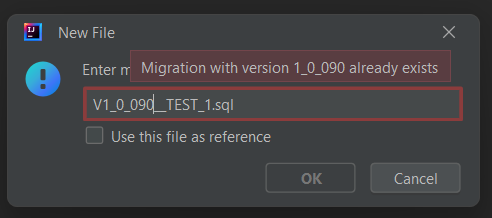

<h1 style="display: flex">Flyway Helper</h1> 
You don't need to worry anymore when working with flyway.

------------------
Avoid having migration ve rsion conflicts and get an <auto-calculated> version when creating a new one.\
The plugin goes even further and let you specify a remote branch to take into 
consideration while checking for version conflicts or/and when generating your 
<auto-calculated> next migration.

### How to use
* Install the plugin 
* Mark the parent directory where you hold your migrations (it can be a directory containing other folders) as migration root:
<i>Right click on the folder -> mark directory as -> Migration Root</i>
* Go to the directory where you want to create the migration(either ddl or dml)
* Right-click on the directory or on any of its child files
* Choose: <i>New -> New Migration</i>
* You get the new file dialog with a default value containing the next migration version
* If you want to sync with a remote branch you can configure it in: <i>Tools -> flyway helper -> configure sync branch</i>
* If sync branch is configured, you should refresh the migrations (before using the <i>New Migration</i> action) by : \
<i>Right click on a migration file -> Flyway Helper -> Refresh migrations</i>
  <i>
<b>
    PS: You can also use a file as reference by invoking the new migration action on it and then checking the 
    \<Use this file as reference\> checkbox.
  </b>
</i>
  <i>
<b>
    PS2: Migration Root Folder and Sync Branch is specified by project. You can have different configs for each project.
  </b>
</i>

 
<h5 style="text-align:center;opacity: 70%">Made with ❤️ by Red1.</h5>